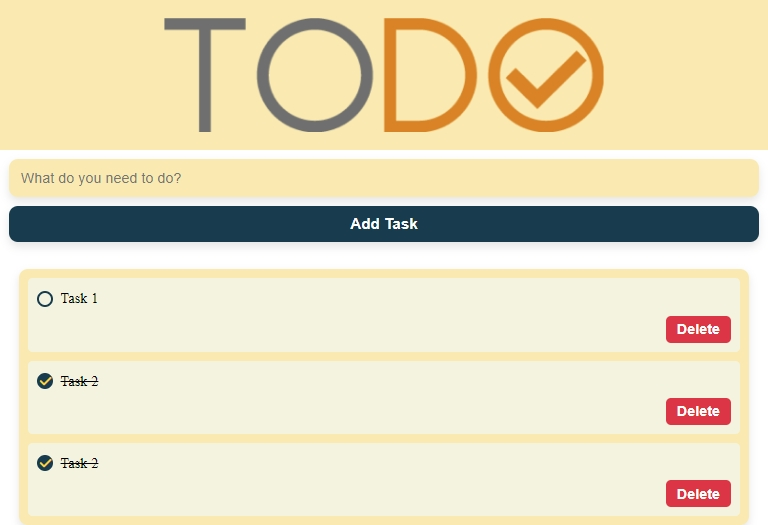
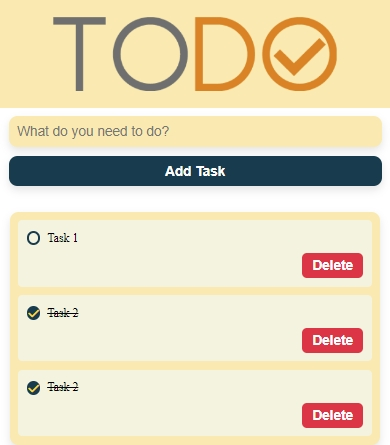

# 📝 To-Do List Application — v1.0

A clean and lightweight **To-Do List web application** built using **Vanilla JavaScript**, focusing on **core DOM manipulation**, **localStorage**, and **fundamental front-end concepts** without any frameworks or build tools.

🔹 This is **Version 1.0**, representing the **initial implementation** of the project before migrating to TypeScript and advanced architecture in later versions.

---

## 🚀 Live Demo & Repository

- 🔗 **Live Demo:**  
  <https://fathyhesham.github.io/TO-DO-List-Application-v1.0/>

- 📂 **GitHub Repository:**  
  <https://github.com/FathyHesham/TO-DO-List-Application-v1.0>

---

## 🧠 About Version 1

Version 1 focuses on mastering the **foundations of Front-End Development**, including:

✔ Pure JavaScript (ES6+)  
✔ Direct DOM manipulation  
✔ Event handling  
✔ LocalStorage for data persistence  
✔ Clean and readable code structure  

This version intentionally avoids frameworks to demonstrate a strong understanding of **JavaScript fundamentals**.

---

## ✨ Features

- ➕ Add new tasks
- ✅ Mark tasks as completed
- ✏️ Edit existing tasks
- 🗑 Delete tasks
- 💾 Persistent data using LocalStorage
- 📱 Responsive design
- ⚡ Fast and lightweight (no build tools)

---

## 🏗️ Project Structure

```plaintext
TO-DO-List-Application/
│
├── index.html
├── css/
│   └── style.css
├── js/
│   └── script.js
└── images/
    ├── screenshot.svg
    ├── screenshot-laptop.svg
    ├── screenshot-tablet.svg
    └── screenshot-mobile.svg
```

---

## 🛠️ Technologies Used

- **HTML5**
- **CSS3** (Flexbox / Responsive Design)
- **Vanilla JavaScript (ES6+)**
- **LocalStorage API**

---

## ⚙️ How to Run the Project

### 1️⃣ Live Demo (Recommended)

Just open the link below in your browser:

👉 [https://fathyhesham.github.io/TO-DO-List-Application/](https://fathyhesham.github.io/TO-DO-List-Application/)

---

### 2️⃣ Run Locally

#### Option A — Using Git

```bash
git clone https://github.com/FathyHesham/TO-DO-List-Application.git
cd TO-DO-List-Application
```

Then open `index.html` in your browser.

#### Option B — Without Git

1. Click **Code → Download ZIP**
2. Extract the folder
3. Double-click `index.html`

No setup required ✅

---

## 🔄 Application Workflow

1. Open the application
2. Existing tasks load automatically from LocalStorage
3. Add a new task using the input field
4. Mark tasks as completed
5. Edit or delete tasks
6. Refresh the page — data remains saved

---

## 📸 Preview

### Desktop / Laptop


### Tablet



### Mobile



---

## 🔄 Version Comparison

| Version  | Description                         |
| -------- | ----------------------------------- |
| **v1.0** | Vanilla JavaScript, basic DOM logic |
| **v2.0** | TypeScript, clean architecture, OOP |

➡️ **Check Version 2:**
[https://github.com/FathyHesham/TO-DO-List-Application-v2.0](https://github.com/FathyHesham/TO-DO-List-Application-v2.0)

---

## 📈 Future Enhancements (Planned in v2)

- TypeScript migration
- Modular architecture
- OOP principles
- Better scalability
- Safer DOM handling

---

## 👨‍💻 Author

**Fathy Hesham**
Front-End Developer & Machine Learning Engineer

- 🔗 GitHub: [https://github.com/FathyHesham](https://github.com/FathyHesham)

- 🔗 LinkedIn: [https://www.linkedin.com/in/fathy-hesham/](https://www.linkedin.com/in/fathy-hesham/)

- 🔗 Portfolio: [https://fathyhesham.github.io/My-Portfolio/](https://fathyhesham.github.io/My-Portfolio/)

- 📧 Email: [fathyhesham2001@gmail.com](mailto:fathyhesham2001@gmail.com)

---

⭐ If you like the project, don’t forget to star the repository!
